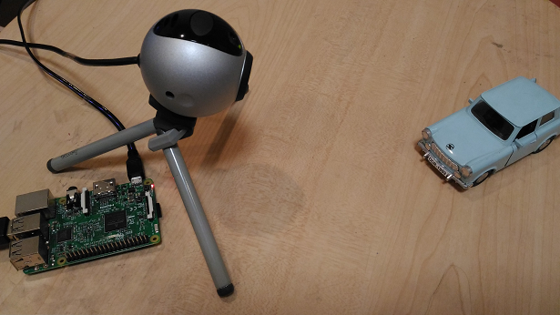
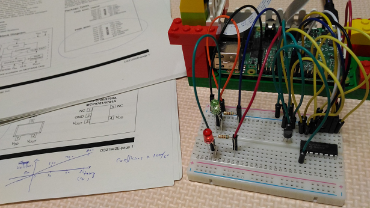
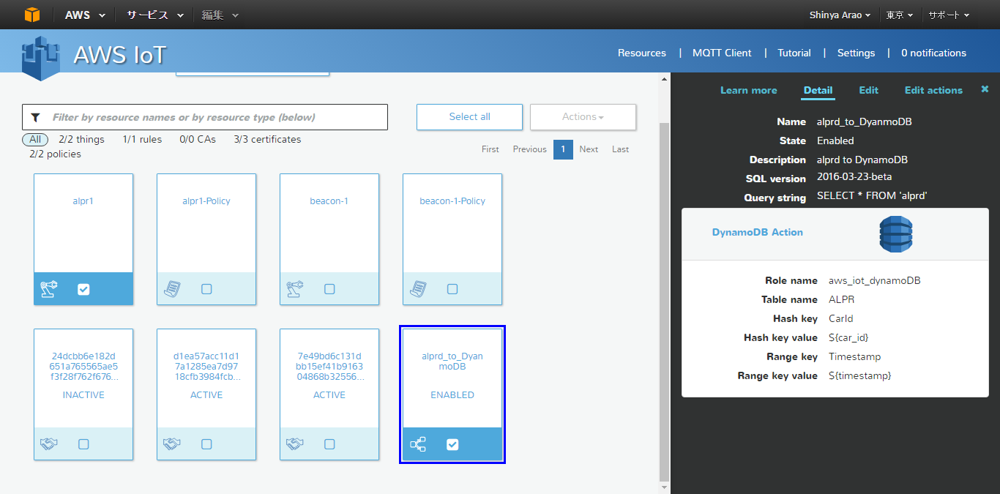
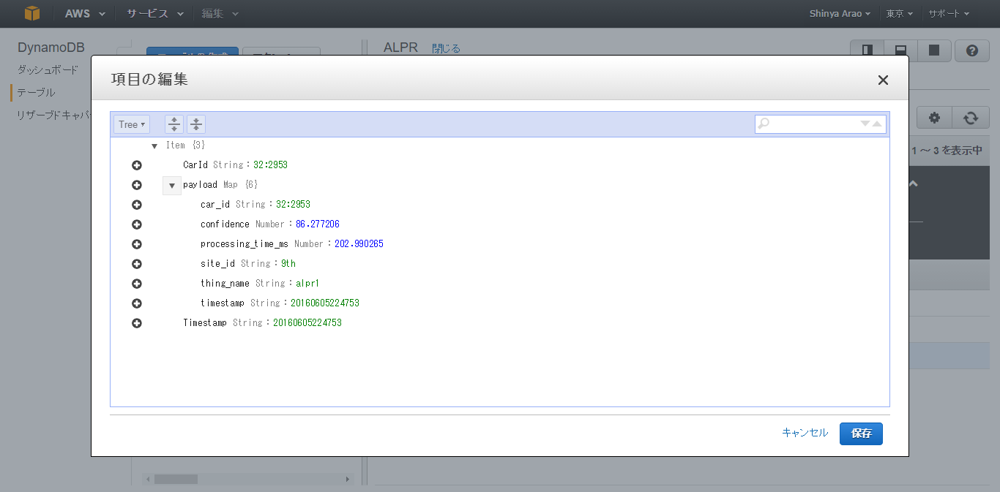
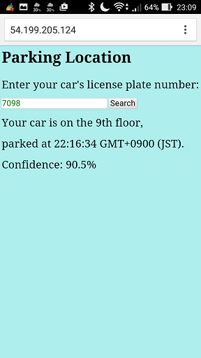
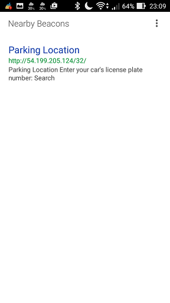
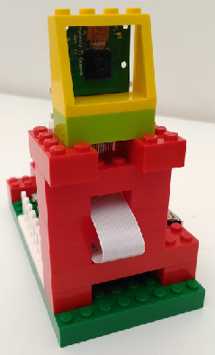

#Use case: where is my car?

Note: This project is dependent on AWS IoT and DynamoDB, but I am considering to migrate to ZooKeeper/Cassandra for some reasons...

##The IoT toy I develop is Automatic License Plate Recognition


##Background and motivation

####Why I am interested in the use case

I go shopping at these malls on weekends. The problem is that sometimes I do not remember where I parked my car...

- [Northport Mall, Yokohama](https://www.google.co.jp/maps/@35.5507775,139.5792885,3a,75y,2h,101.12t/data=!3m6!1e1!3m4!1sr2XS6qJGnbIkwTT953SWPA!2e0!7i13312!8i6656)
- [Sogo, Kashiwa](https://www.google.co.jp/maps/@35.8644843,139.9731393,3a,75y,144.06h,112.16t/data=!3m6!1e1!3m4!1sHc9UH1NphEztWjDAM0G-Bg!2e0!7i13312!8i6656)
- [AEON mall, Makuhari](https://www.google.co.jp/maps/@35.6573085,140.0245396,3a,75y,154.86h,91.46t/data=!3m6!1e1!3m4!1sQEXUIVr33EV5ebIr5tE0rA!2e0!7i13312!8i6656)

[OpenALPR](https://github.com/openalpr/openalpr) is a very interesting open source software to tackle the problem. I just want to try out the software with my Raspberry Pi 3. That is the motivation.

##The toy I develop

I have made the toy with LEGO and my Raspberry Pi 3:



##Architecture

####Overall architecture


Why is beacon(Eddystone) required for this system? Get rid of an expensive special-purpose Kiosk, just use your smart phone that detects beacon, extracts an URL of a car search page from the beacon, and opens up Chrome browser.

Why is Cassandra or DynamoDB used for storing data? Cassandra/DynamoDB is suitable for this use case, because they are good at storing time-series data with write-intensive usage, whereas MongoDB is good at read-intensive usage. 

####Thing management via AWS IoT

I use AWS IoT Shadow to manage my things: [Thing management](./thing/README.md).

####Minimum setup

Everything runs on my Raspberry Pi 3 except for the device management.


####Working with AWS services

- Cassandra is replaced with DynamoDB (I need to add TTL feature somewhere).
- app.js runs on an EC2 instance.


####Physical configuration (Internet of Things)

I use WiFi and 4G (e.g., NTT DoCoMo or SORACOM) to connect my devices to the Internet.

Note that "Internet of Things" is about a network of things, not about a network of micro services: IoT is one of networking technologies.


####Sensors

Two types of time-series data is published to MQTT broker on AWS IoT:
- Licence plate numbers recognized by OpenALPR (alprd) -- topic name "alprd"
- Temperature and luminousity -- topic name "sensor"


And the wirling on the solderless breadboard:



Regarding the technical details, refer to [this page](./doc/electronic_kit.md):
- The electronic circuit
- Controling the AD converter (MCP3008)
- Temperature calculation

####Screenshots from AWS IoT

This is a list of my things:


I created a rule to forward location data from MQTT server to DynamoDB. The topic name is "alprd".



DynamoDB is cool. I assigned "CarId"(garage_id:plate) as a hash key and "Timestamp" as a seconday index:



##Software components used in this project
- node.js/express/angular.js with cassandra-driver
- [OpenALPR](https://github.com/openalpr/openalpr)
- [beanstalkd](http://kr.github.io/beanstalkd/) and [fivebeans](https://github.com/ceejbot/fivebeans)
- [node-eddystone-beacon](https://github.com/don/node-eddystone-beacon)
- [Cassandra](http://cassandra.apache.org)
- AWS: IoT (incl. its client SDK), DynamoDB and EC2

##Building OpenALPR on Raspberry Pi

First, you have to build OpenCV. Follow the instructions here: http://docs.opencv.org/3.0-last-rst/doc/tutorials/introduction/linux_install/linux_install.html

Don't forget to install libv4l-dev before cmake:
```
$ sudo apt-get install libv4l-dev
```
And add this option to cmake: -DWITH_LIBV4L=ON

It took one hour to complete the build processes.

Then, follow the instructions on this page: https://github.com/openalpr/openalpr/wiki/Compilation-instructions-%28Ubuntu-Linux%29

It took some ten minutes.

Check if ALPR works on your Raspberry Pi:
```
pi@raspberrypi:/tmp $ wget http://plates.openalpr.com/h786poj.jpg -O lp.jpg
--2016-05-10 20:45:51--  http://plates.openalpr.com/h786poj.jpg
Resolving plates.openalpr.com (plates.openalpr.com)... 54.231.114.105
Connecting to plates.openalpr.com (plates.openalpr.com)|54.231.114.105|:80... connected.
HTTP request sent, awaiting response... 200 OK
Length: 62721 (61K) [image/jpeg]
Saving to: ‘lp.jpg’

lp.jpg              100%[=====================>]  61.25K   125KB/s   in 0.5s

2016-05-10 20:45:52 (125 KB/s) - ‘lp.jpg’ saved [62721/62721]

pi@raspberrypi:/tmp $ alpr lp.jpg
plate0: 8 results
    - 786P0      confidence: 90.1703
    - 786PO      confidence: 85.579
    - 786PQ      confidence: 85.3442
    - 786PD      confidence: 84.4616
    - 7B6P0      confidence: 69.4531
    - 7B6PO      confidence: 64.8618
    - 7B6PQ      confidence: 64.627
    - 7B6PD      confidence: 63.7444
```

It took something like 10 seconds to recognize a number, so it is not plactical -- you should run alprd instead.

##node.js/express

You must install a middleware 'body-parser' for express POST operations:
```
$ sudo npm -g install body-parser
```

```
var bodyParser = require('body-parser');

app.use(bodyParser.urlencoded({ extended: true }));
app.use( bodyParser.json() );

app.post(  ...
```

##Portal (web page) for searching your car

This is a Kiosk-like GUI I have developed with HTML5 and AngularJS. Smart phones receives URL from beacons installed in the mall (e.g., in front of elevators), then open up this web page automatically.

AngularJS-based page: [index.html](./portal/www/index.html)

You enter your car's licence plate number on the GUI. If the system can find your car on the database and if it was parked in the past 24 hours, it shows the location of your car.



##Emitting URL of the web page from your Raspberry Pi

Note: Eddystone cannot advertise URL longer than 18 bytes. Use the following URL shortner service: https://goo.gl/

Include the following lines in your Java script:
```
var beacon = require('eddystone-beacon/index');
beacon.advertiseUrl(url);
```



##OpenALPR training for Japanese car licence plates (calibration/tuning)

In case of the default setting (country = us),  "2" can be recognized as "Z", and "0" as "O" or "D". For the time being, you may use country = us and use a matching pattern "####(4 digits)" by modifying the following file:
https://github.com/openalpr/openalpr/blob/master/runtime_data/postprocess/us.patterns

```
$ cd /usr/share/openalpr/runtime_data/postprocess

Open the file "us.patterns" and append "jp              ####" to it.

$ cd /etc/openalpr

Open the file "alprd.conf" and edit it as follows:

  [daemon]
  
  ; country determines the training dataset used for recognizing plates.
  ; Valid values are: us, eu, au, auwide, gb, kr, mx, sg
  country = us
- ;pattern = ca
+ pattern = jp 

```


To get most out of OpenALPR, you must train it. Take pictures of Japanese license plates, then use the following utilites to train it:
- https://github.com/openalpr/train-ocr
- https://github.com/openalpr/train-detector

##Issues

- My USB webcam stops working just after I have started Cassandra. I disabled wlan0, but it does not solve the problem.
- My powered USB 3.0 hub does not work with Raspberry Pi. See this page: https://www.raspberrypi.org/documentation/hardware/raspberrypi/usb/README.md

So I have bought a camera module for RPi:
- https://www.raspberrypi.org/products/camera-module/
- https://www.raspberrypi.org/documentation/usage/camera/

Don't forget to load the following kernel module for V4L2: 
```
$ sudo modprobe bcm2835-v4l2
```


##Wish list

#### Docker-based software management for IoT gateways (i.e., Raspberry Pi 3)

AWS Shadow is OK, but AWS does not support software life cycle management (such as software upgrade) for IoT gateways. I use neither Chef, Puppet nor Ansible, since those tools make things complicated. I want something like [Resin.io](https://resin.io/) that is based on Docker.

AWS recommends us to use Shadow and S3 for OTA: https://forums.aws.amazon.com/thread.jspa?messageID=706302

I should also check out [Google Brillo](https://developers.google.com/brillo/).

#### Data analysis

Use [Apache Spark](http://spark.apache.org/) to analyze the data on AWS DynamoDB:
- the throughput of ALPR processing
- correlation between the temperature and the number of cars entering into the garage

Reference: https://blogs.aws.amazon.com/bigdata/post/Tx1G4SQRV049UL0/Analyze-Your-Data-on-Amazon-DynamoDB-with-Apache-Spark

##What I have learned so far from this project

####System integration processes for IoT

THINK OF IOT AS A WHOLE SYSTEM!

Very critical:

- Security (incl. authentication/authorization)
- System performance guarantee and SLA
- Remote device management (incl. software update and certificate installation)
- Stable power suply for the things
- Stable network connectivity for the things

Edge computing:

- Stream processing at IoT gateways

System integration test:

- You cannot automate the test: you need to run cars in front of the camera.

####Enterprise integration patterns

When it comes to messaging such as MQTT (e.g., pubsub, event-driven and asynchronous messaging), you had better read this: http://www.enterpriseintegrationpatterns.com/
