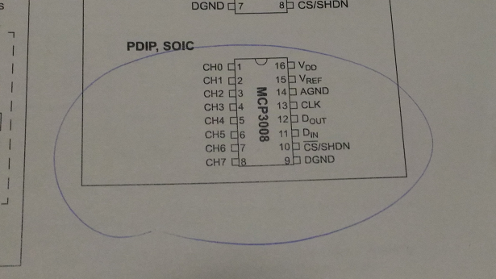
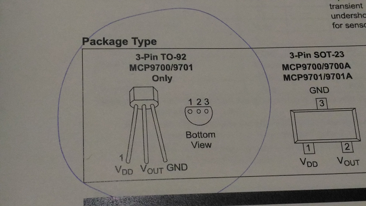
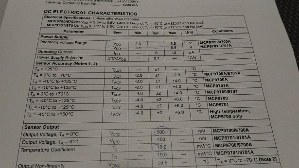
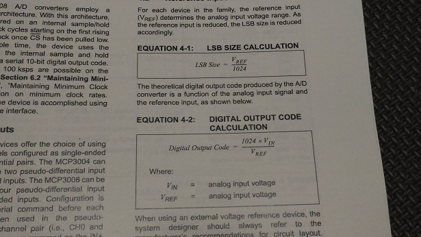
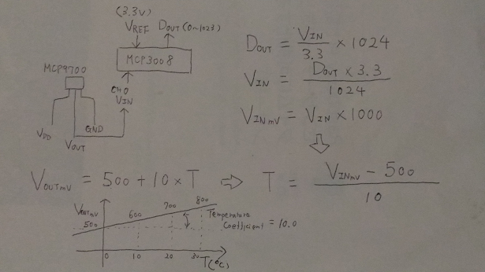
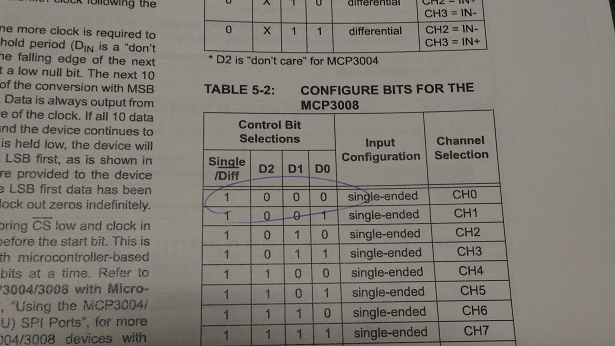
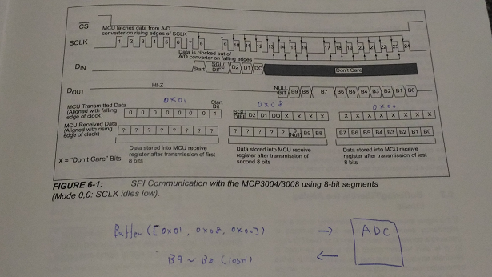

# Electronic kit

I bought this kit: https://www.amazon.co.jp/gp/product/B00MRQ5U1Y/ref=oh_aui_detailpage_o00_s00?ie=UTF8&psc=1

##Parts

- [MCP3008](https://cdn-shop.adafruit.com/datasheets/MCP3008.pdf)

- [MCP9700-E/TO](http://ww1.microchip.com/downloads/en/DeviceDoc/21942e.pdf)

- [MI5](http://akizukidenshi.com/download/ds/macron/MI5_series_jp.pdf)

## Temperature calculation

####MCP9700 DC electrical characteristics

####MCP3008 digital output code calculation

####Temperature calculation

I made [this code](../thing/temperature.js) to obtain the output from MCP3008 and calcuate the temperature.

##Communicating with MCP3008 via SPI

Control bit: 1000

Send [0x01, 0x80, 0x00] from your Raspberry Pi to MCP3008 via SPI. MCP3008 returns 10bit data (value range: 0 - 1023).

