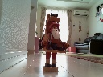

# Testing Pi camera with OpenCV and TensorFlow

## Architecture
```
                                TensorFlow
Target <- - - [pi camera]-----[Raspberry Pi 3]
```

## Setup

### Creating image buffer "/var/hamster"

Edit /etc/fstab
```
tmpfs /var/hamster tmpfs nodev,nosuid,size=8M 0 0 
```

Mount the RAMDISK on "/var/hamster":
```
$ sudo mkdir /var/hamster
$ sudo mount -a
$ df
Filesystem     1K-blocks    Used Available Use% Mounted on
/dev/root       14004144 8666660   4603072  66% /
devtmpfs          437208       0    437208   0% /dev
tmpfs             441524       0    441524   0% /dev/shm
tmpfs             441524    6048    435476   2% /run
tmpfs               5120       4      5116   1% /run/lock
tmpfs             441524       0    441524   0% /sys/fs/cgroup
/dev/mmcblk0p6     64366   19976     44390  32% /boot
tmpfs              88308       0     88308   0% /run/user/109
tmpfs              88308       4     88304   1% /run/user/1000
tmpfs               8192       0      8192   0% /var/hamster
```

### Importing TensorFlow's classify_image.py

Add the imagenet path to PYTHONPATH:
```
export PYTHONPATH=/usr/local/lib/python2.7/dist-packages/tensorflow/models/image/imagenet:$PYTHONPATH
```

Then source the path:
```
$ . ~/.bashrc
```

### Test

```
$ python capture.py
```



```
throne (score = 0.34844)
four-poster (score = 0.02419)
window shade (score = 0.02221)
barber chair (score = 0.02089)
rocking chair, rocker (score = 0.01760)

```
