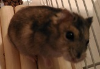

# hamster



Djungarian hamster "Ruby"

I have used "classify_image.py" to recognize Ruby as hamster:

````
hamster (score = 0.45782)
panpipe, pandean pipe, syrinx (score = 0.32480)
fox squirrel, eastern fox squirrel, Sciurus niger (score = 0.01677)
mousetrap (score = 0.01429)
radiator (score = 0.00905)
```


```
hamster (score = 0.72409)
wombat (score = 0.05403)
black-footed ferret, ferret, Mustela nigripes (score = 0.04547)
polecat, fitch, foulmart, foumart, Mustela putorius (score = 0.04081)
weasel (score = 0.01739)
```


```
hamster (score = 0.53216)
wombat (score = 0.10011)
Norwegian elkhound, elkhound (score = 0.07616)
black-footed ferret, ferret, Mustela nigripes (score = 0.01688)
Crock Pot (score = 0.01552)
```


```
mousetrap (score = 0.60099)
fox squirrel, eastern fox squirrel, Sciurus niger (score = 0.11269)
wood rabbit, cottontail, cottontail rabbit (score = 0.08913)
beaver (score = 0.03204)
hare (score = 0.01051)
```
